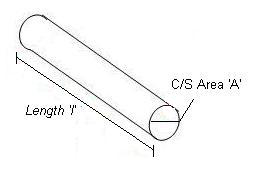
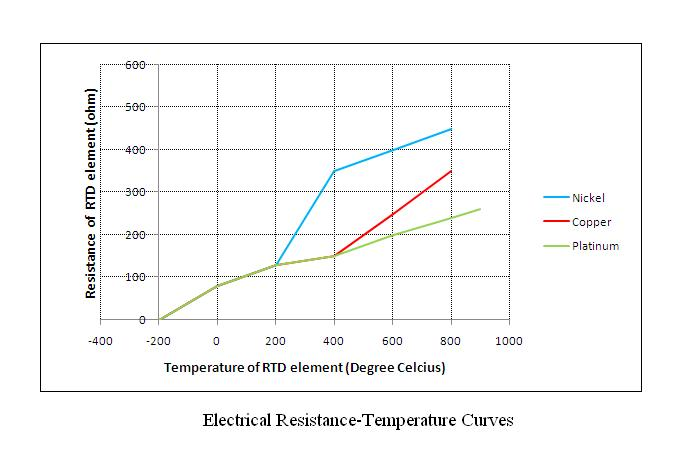

### Prerequisite:

Before performing the practical on RTD one must be well versed with:
1.   Importance of temperature measurement.
2.   Various units of temperature measurement and conversion of one unit to another.
3.   Knowledge of various methods of temperature measurement.
4.   Meaning of terms like process lag, positive and negative temperature coefficient, negative temperature, virtual temperature, etc.
5.   Knowledge of active and passive transducers. 

 ### Temperature:

Temperature is a measure of the average heat or thermal energy of the particles in a substance. Since it is an average measurement, it does not depend on the number of particles in an object. In that sense it does not depend on the size of it. For example, the temperature of a small cup of boiling water is the same as the temperature of a large pot of boiling water. Even if the large pot is much bigger than the cup and has millions and millions more water molecules. The basic unit of temperature (T) in the International System of Units (SI) is the Kelvin (K). The commonly used other units of temperature are Degree Celsius (°C) and Degree Fahrenheit (°F). 

 ### Electrical Resistance:
The electrical resistance of an object is a measure of its opposition to the flow of an electric current. For a wide range of materials and conditions, the electrical resistance does not depend on the amount of current through or the potential difference (voltage) across the object. That means the resistance R is constants for the given temperature and material. Therefore, the resistance of an object can be defined as the ratio of voltage to current, in accordance with 
>Ohm’s Law: 
            R = V/I

The unit of resistance is ohm (Ω). 

#### Temperature Measurement using RTD
For measurement of Temperature number of sensors are available. One of the most linear, stable, and reproducible temperature sensors is the RTD, Resistance Temperature Detector. In RTD, the  output resistance changes with temperature. RTD is a positive temperature coefficient device. The resistance of the metal increases with temperature. The resistive property of the metal is called its resistivity. The resistive property defines length and cross sectional area required to fabricate an RTD of a given value. The resistance is proportional to length and inversely proportional to the cross sectional area and is given by the relationship

                                 R = ρl/A                                            

 Where 'R' is resistance of the metal, 'ρ' is the resistivity of the metal, 'l' is the length of the metal and 'A' is the area of cross section of the metal.
 

 
 ### Resistance Temperature Detector (RTD)

Resistance Temperature Detector (RTD), as the name implies, is a sensor used to measure temperature by correlating the resistance with temperature. Most RTD elements consist of a length of fine coiled wire wrapped around a ceramic or glass core. The element is usually quite fragile, so it is often placed inside a sheathed probe to protect it. The RTD element is made from a pure metals as mentioned below. The material property to have predictable change in resistance as the temperature changes, is used to determine temperature.

Commonly used RTD Materials:
- Platinum (most popular and accurate)
- Nickel
- Copper
- Balco (rare)
- Tungsten (rare)

### Temperature calculations:

RTDs are manufactured from metals whose resistance increases with temperature. Within a limited temperature range, its resistance increases linearly with temperature:
            Rt = R0[1+ α (t-t0)]  

Where:
Rt = resistance at temperature 't' \
R0 = resistance at a reference temperature ( Generally 0 degree C) \
α = temperature coefficient of resistance (°C‾1)

Setting t0 to 0°C and rearranging to the standard linear y = m*x+b form, it is clear that resistance vs. temperature is linear with a slope equal to 

                                    R / R0 = α*t + 1 
									

                                                             

Theoretically, any metal can be used to measure temperature. The metal selected should have a high melting point and an ability to withstand the effects of corrosion. Therefore Platinum is  selected for most of the applications. Its desirable characteristics include chemical stability, availability in a pure form, and electrical properties that are highly reproducible.

Solving Equation (1) for α:
         α = (R100 - R0) /( R0 *(t-t0))                                               
Where,

t = 100°C & t0 = 0°C

For platinum, α = 0.00385 Ω/Ω/°C 

The relationship between resistance and temperature of RTD can be approximated by the Callendar-Van Dusen equation which is given by,

       Rt / R0 = 1+ α [ t – δ((t/100)-1)(t/100) –β((t/100)-1)(t/100)3]                     

Where,

t = temperature (°C) \
Rt = Resistance at temperature, t°C \
R0 = Resistance at 0°C \
α = Constant ( 0.00385Ω/Ω/°C )

δ & β are Linearization coefficients, where β = 0 for t > 0°C

The Callendar Van Dusen Equation is used in the standard IEC 751 which is the most popular standard used for RTD. The equation for RTD given in IEC 751 is:

          Rt =R0 [1+ At+ Bt2 +C(t-100)t3 ]                                            

Where,
A,B,C are constants and C = 0 for t > 0°C.

The values of A,B and C for α = 0.00385 are \
A = 3.9083*10-3°C‾1 \
B = -5.775*10-7°C‾2 \
C = -4.183*10-12°C‾4 

Platinum RTDs are defined by standards such as DIN 43760 (BS1904), IEC 751-1983, and JIS C1604.

### RTD Materials:

The criterions for selecting a material for an RTD:

- Malleability to form small wires.
- Linear relationship of resistance and temperature.
- Repeatability and stability.
- Corrosion.
- Low cost
- Easy availability
 
### RTD Performance Specifications: 
1. Temperature Coefficient :It is the change in resistance of the material per degree change in temperature. This value should be as high as possible to give higher accuracy of temperature measurement.

2. Accuracy:It is the comparison of measurement with standard results.That is how good the data is when compared with a recognized standard. The accuracy of a measurement system is the degree of closeness of measurements of a quantity to its actual (true) value.

3. Stability: It is the measurement of drift over time. Stability is affected by sensor design. Well designed, high quality sensor will have less drift while high vibration, mechanical wear and tear and thermal shock will degrade the stability.

4. Interchangeability: Interchangeability is the measure of change in base tolerance and temperature coefficient from sensor to sensor. This is important when replacing a sensor, to insure that the system retains its performance characteristics without any need for re-calibration.

5. Response time: Response time is time the sensor takes to react to temperature changes in a process.

### Factors that influence the sensor response:

• Thermal lag  when combined with the thermowell \
• Immersion length \
• Flow velocity of the process fluid \
• Process fluid transients \
• Fluid boundary or film on sensing surface \
• Influences from wall or vessel \
• Environmental factors

6. Insulation resistance: It is the largest cause of errors and failure of RTD. The causes can be an inadequate seal, high humidity environment, or a failed seal. In some cases baking the RTD assembly will increase the insulation resistance and recover the RTD.

7. Self heating: The very small cross-sectional areas in the sensing elements will tend to heat when electrical current is applied. Most RTDs are specified to be operated with a current of 1 milliampere or less.
